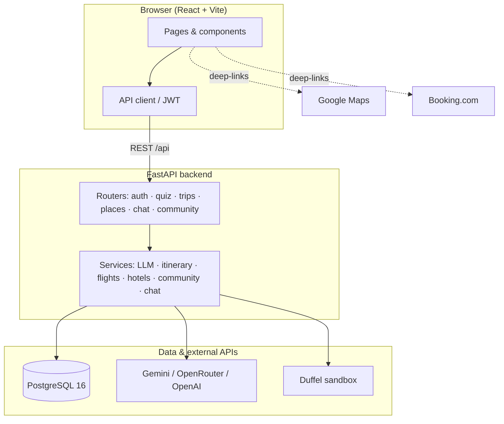

<div align="center">

# RihlaTech

**Powered by AI, driven by you.**

[]()
[]()
[]()
[]()
[]()

*King Saud University — IS498 Final Year Project*

</div>

---

## What is it?

Planning a trip means juggling dates, budgets, destinations, and dozens of tabs — most tools either feel generic or leave you doing the heavy lifting. **RihlaTech** is a web app that turns a short quiz and your preferences into a personalized, day-by-day itinerary in minutes. An AI travel companion helps you refine the plan, and every activity links straight to Google Maps for navigation.

---

## Key features

- **Smart quiz & preferences** — dates, travelers, destination (Mapbox city search); optional flights (Duffel airport origin) and hotels; pace + multi-select interests
- **AI itinerary generation** — real venue names, themed days, activities saved to your account
- **“Not sure” destination path** — AI-suggested cities when you haven’t picked one yet
- **Home dashboard** — plan a new trip, ask AI for travel advice, recent trips
- **My Trips** — list, reopen, and delete past itineraries (in-app delete confirmation)
- **Trip chatbot** — context-aware Q&A, propose edits, confirm with **Apply** or “yes”
- **Home consult chat** — general travel Q&A before you start planning
- **Flights & hotels** — Duffel sandbox flight options + Google Flights deep-links; hotel cards with Booking.com links (when enabled in quiz)
- **Collapsible trip result** — flights, hotels, and each day expand on demand with horizontal activity cards
- **Google Maps links** — open any activity in Maps; per-day driving routes between stops
- **App shell** — Home · My Trips · Community; Profile on desktop nav + mobile header icon
- **Community** — share itineraries, discover feed, vote, save, and comment
- **Light-mode auth** — login and register match the app’s default light theme

> Full roadmap and API reference: [plan.md](plan.md)

---

## User flow

```
Login → Home dashboard
          ├─ Plan new trip → Quiz → Preferences → [AI destination picker] → Trip result
          ├─ Ask AI (consult) — travel tips without a trip yet
          └─ My Trips → reopen any itinerary

Trip result → Flights / Hotels (if enabled) → Day-by-day itinerary
            → Share to Community
            → Ask AI (trip chat) → propose edit → Apply / "yes"
            → Open in Maps / Day route → Back to My Trips

Community → Discover / Saved → open trip → vote, save, comment
```

| Step | What happens |
|------|----------------|
| **Quiz** | Destination known? → dates → destination (if yes) → include flights? → airport origin (if yes) → travelers |
| **Preferences** | Trip purpose, pace, themes (up to 2), budget, optional hotel suggestions |
| **Destination picker** | Shown only when destination is “not sure” — AI city suggestions |
| **Result** | Collapsible flights, hotels, and days; Maps deep-links; share to Community |
| **Community** | Discover feed, saved trips, vote/save, comments on shared itineraries |
| **Chat** | Trip-tied edits on result page; general consult from Home |

---

## Architecture



---

## Stack

| Layer | Technology |
|-------|------------|
| Frontend | React 18, Vite, Tailwind CSS, shadcn/ui, Framer Motion |
| Backend | FastAPI, SQLAlchemy |
| Database | PostgreSQL 16 (Docker) |
| Auth | JWT (python-jose) + bcrypt |
| AI | Gemini, OpenRouter, or OpenAI (`LLM_PROVIDER` in `.env`) |
| Flights | Duffel sandbox (`DUFFEL_ACCESS_TOKEN`) + airport autocomplete; Google Flights deep-links (IATA) |
| Hotels | Mock suggestions + Booking.com deep-links |
| Navigation | Google Maps deep-links (per activity and per-day routes) |
| Geocoding | Mapbox Search Box + geocoding v5 (cities); Duffel + Mapbox for airports |

---

## Progress

| Phase | Status | Summary |
|-------|--------|---------|
| 0 — Setup | ✅ | FastAPI, PostgreSQL Docker, Vite proxy |
| 1 — Auth | ✅ | Register, login, JWT, protected routes |
| 2 — Quiz | ✅ | Quiz + preferences, AI destination suggestions |
| 3 — Itinerary | ✅ | LLM day-by-day generation, places in DB, result page |
| 4 — Maps | ✅ | City search, Google Maps deep-links on result page |
| 5 — Edit & chat | ✅ | My Trips, chatbot, apply-edit, itinerary updates |
| 5b — App shell & mobile | ✅ | Home dashboard, profile, consult chat, responsive pass |
| 6 — Flights/hotels | ✅ | Duffel sandbox + mock fallback; Booking.com deep-links |
| 6b — UX polish | ✅ | Collapsible result, light auth, nav + delete dialog |
| 7 — Community | ✅ | Share, vote, save, comment on shared itineraries |
| 7b — Validation & polish | ✅ | Quiz validation, mobile quiz/nav fixes, faster generate |
| 8 — Admin/deploy/PWA | ✅ | Admin dashboard, Vercel + Render + Neon, PWA |
| Refinements + quiz redesign | ✅ | Auth polish, planning UX, conditional origin, airport search |

**Deployed:** [Vercel](https://vercel.com) (frontend) · [Render](https://render.com) (API) · [Neon](https://neon.tech) (Postgres)

See [plan.md](plan.md) for roadmap and polish backlog.

---

## Setup

### Prerequisites

- Node.js 18+
- Python 3.11+
- Docker Desktop (PostgreSQL)
- API keys — see `.env.example`

### Run locally

```bash
# 1. Environment
cp .env.example .env
# Fill in JWT_SECRET, LLM keys, MAPBOX_ACCESS_TOKEN, DUFFEL_ACCESS_TOKEN (optional)

# 2. Dependencies
npm install
cd backend && python -m venv .venv
.venv\Scripts\pip install -r requirements.txt          # Windows
# source .venv/bin/activate && pip install -r requirements.txt   # macOS/Linux

# 3. Database (host port 5433, not 5432)
docker compose up -d

# 4. Backend
cd backend
.\.venv\Scripts\uvicorn app.main:app --reload --port 8000

# 5. Frontend (new terminal, repo root)
npm run dev
```

Open **http://localhost:5173**

Restart **both** backend and `npm run dev` after changing `.env` (Vite reads `VITE_*` only at startup).

### Test on your phone (same Wi‑Fi)

`npm run dev` prints **Network** URLs. Use the **`192.168.x.x`** address (your Wi‑Fi IP), not `172.x.x.x` (virtual adapter from WSL/Docker).

### Admin (local)

```bash
cd backend
.\.venv\Scripts\python scripts\promote_admin.py your@email.com
```

Log in → Profile → **Admin dashboard** (stats, users, trips, community moderation).

### Deploy (Vercel + Render + Neon)

1. **Neon** — Postgres; copy connection string → Render `DATABASE_URL`
2. **Render** — Web service from `render.yaml` (`backend/`, health `/api/health`)
3. **Vercel** — Vite app; set `VITE_API_BASE_URL=https://<your-api>.onrender.com/api`
4. **Render** — `CORS_ORIGINS=https://<your-app>.vercel.app`
5. Promote admin on prod DB; smoke-test login → quiz → generate

See `plan.md` for full checklist and admin API reference.

### Scripts

```bash
npm run dev          # Frontend dev server
npm run build        # Production build
npm run typecheck    # TypeScript check

# Backend (from backend/)
.\.venv\Scripts\python scripts\promote_admin.py your@email.com
.\.venv\Scripts\python scripts\test_llm.py
.\.venv\Scripts\python scripts\test_generate_flow.py
```

---

## Health checks

| URL | Purpose |
|-----|---------|
| http://localhost:5173/api/health | DB connected |
| http://localhost:8000/api/health/llm | LLM provider configured |
| http://localhost:8000/api/health/mapbox | Mapbox geocoding configured |
| http://localhost:8000/api/health/duffel | Duffel token configured |
| http://localhost:8000/docs | Interactive API docs |

---

## Project structure

```
src/
  pages/               Home dashboard, quiz, trip result, community, my trips, profile
  components/trip/     QuestionFlow, OriginCityInput, TripPlanningLoader, ChatbotSidebar
  components/layout/   Navbar, AppBottomNav, PlanningBackHeader
  components/auth/     AuthLayout (light mode login/register)
  lib/                 API client, auth, trips, community, quizValidation, places, mapDirections
backend/
  app/
    routers/           auth, quiz, trips, places, chat, community, health
    services/          llm, itinerary, flights, hotels, geocoding, place_labels, quiz_validation, community, chat
    models/            user, trip_plan, place, chat_message, community, question
```

---

## Known limitations

- **Single destination per trip** — multi-city / multi-country itineraries not supported yet (see `plan.md` backlog)
- **Desktop home** — wide-screen layout polish deferred
- **Consult chat** — session history is client-side only; not persisted to the database
- **Hotels** — mock cards; hotel names and Booking.com links need per-card differentiation (backlog)
- **Flights** — mock/Duffel cards may share the same Google Flights URL; per-offer links backlog
- **Itinerary generate** — LLM is the main wait; flights/hotels load separately after the itinerary appears
- **Airport origin search** — requires `DUFFEL_ACCESS_TOKEN` (Mapbox Search Box airport POI as fallback)

---

## License

Academic capstone project — KSU IS498. Not licensed for commercial use.
