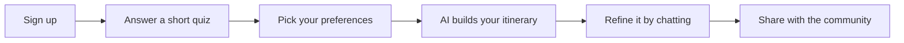

<div align="center">

# RihlaTech

**Powered by AI, driven by you.**

[]()
[]()
[]()
[]()

**Live demo → [rihla-tech.vercel.app](https://rihla-tech.vercel.app)**

*King Saud University — IS498 Final Year Project*

</div>

---

## What is it?

Planning a trip usually means juggling dates, budgets, and a dozen open tabs. **RihlaTech**
turns a short quiz and a few preferences into a personalized, day-by-day travel itinerary
in minutes. An AI travel companion helps you refine the plan, every stop links straight to
Google Maps, and you can share your trips with a community of other travelers.

---

## How it works



---

## Key features

- **AI itinerary** — a day-by-day plan with real venue names, tailored to your dates, budget, and interests
- **Not sure where to go?** — the AI suggests destinations based on your preferences
- **Travel chatbot** — ask questions and apply itinerary changes in plain language
- **Flights & hotels** — sample fares and stay ideas with links to Google Flights and Booking.com
- **Maps** — open any activity in Google Maps, or get a route for the whole day
- **Community** — share your trips, browse others, and vote, save, or comment
- **Installable** — works as a PWA on mobile and desktop

---

## Tech stack

| Layer | Technology |
|-------|------------|
| Frontend | React 18, Vite, Tailwind CSS, shadcn/ui, Framer Motion |
| Backend | FastAPI, SQLAlchemy |
| Database | PostgreSQL 16 |
| Auth | JWT (python-jose) + bcrypt |
| AI | Gemini, OpenRouter, or OpenAI (`LLM_PROVIDER` in `.env`) |
| Maps & geocoding | Mapbox (search) + Google Maps deep-links |
| Flights & hotels | Duffel sandbox + Mapbox lodging; Google Flights / Booking.com deep-links |
| Deploy | Vercel (web) · Render (API) · Neon (database) |

---

## Progress

| Phase | Status | Summary |
|-------|--------|---------|
| Setup & auth | ✅ | FastAPI, PostgreSQL, JWT login/register |
| Quiz & preferences | ✅ | Logistics quiz, preferences, AI destination suggestions |
| AI itinerary | ✅ | Day-by-day generation saved to your account |
| Maps | ✅ | City search, Google Maps deep-links |
| Edit & chat | ✅ | My Trips, chatbot, apply-edit |
| App shell & mobile | ✅ | Home dashboard, profile, consult chat, responsive pass |
| Flights & hotels | ✅ | Duffel sandbox + mock; Booking.com / Google Flights links |
| Community | ✅ | Share, discover, vote, save, comment |
| Admin, deploy & PWA | ✅ | Admin dashboard, Vercel + Render + Neon, installable PWA |
| Refinements & quiz redesign | ✅ | Auth polish, conditional flights/origin, airport search |

**Deferred:** multi-city trips, images API, nationality/passport question. See [`plan.md`](plan.md).

---

## Run locally

**Prerequisites:** Node.js 18+, Python 3.11+, Docker Desktop, and API keys (see `.env.example`).

```bash
# 1. Environment
cp .env.example .env          # add JWT_SECRET, an LLM key, MAPBOX_ACCESS_TOKEN, (optional) DUFFEL_ACCESS_TOKEN

# 2. Install
npm install
cd backend && python -m venv .venv
.venv\Scripts\pip install -r requirements.txt    # Windows

# 3. Database (host port 5433)
docker compose up -d

# 4. Backend
.\.venv\Scripts\uvicorn app.main:app --reload --port 8000

# 5. Frontend (new terminal, repo root)
npm run dev
```

Open **http://localhost:5173**. Restart both servers after changing `.env`.

---

## Documentation

- **[`docs/project-summary.md`](docs/project-summary.md)** — technical deep-dive: system architecture, LLM layer, data model, and user flows
- **[`plan.md`](plan.md)** — roadmap, full API reference, and development notes

---

## License

Academic capstone project — KSU IS498. Not licensed for commercial use.
