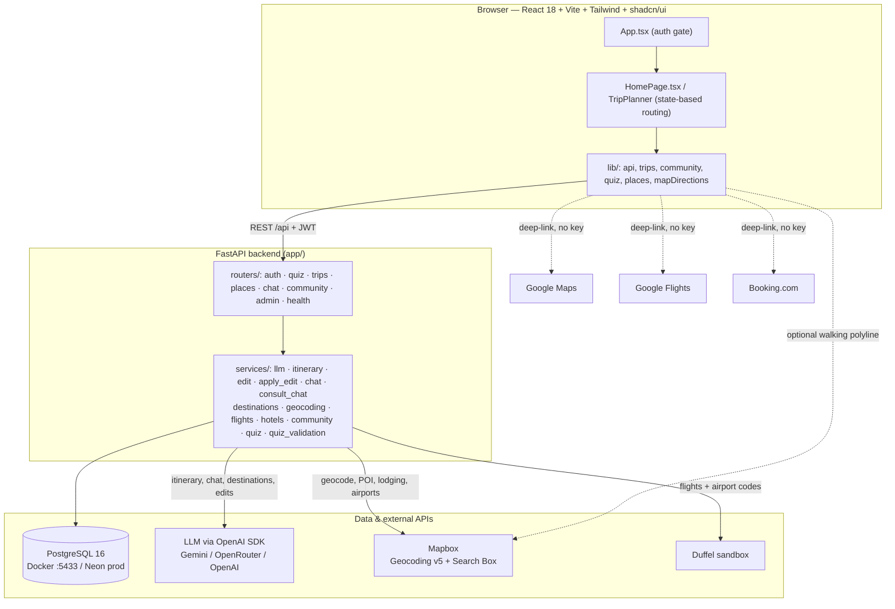
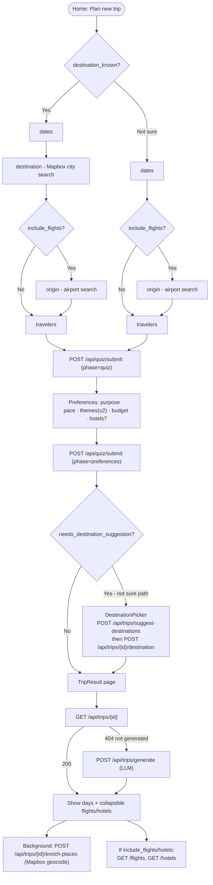
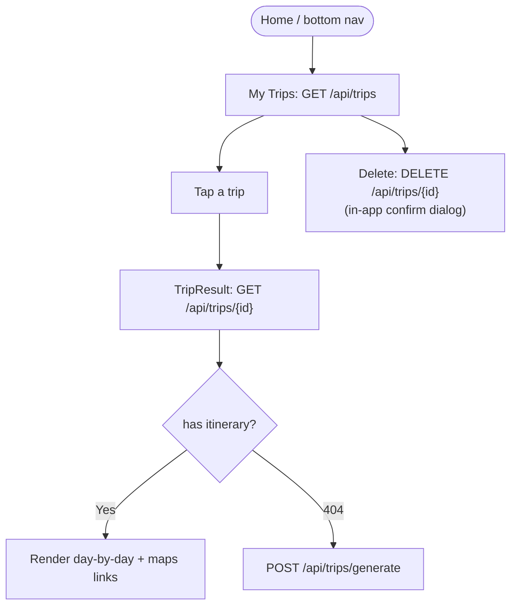
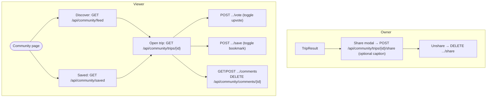
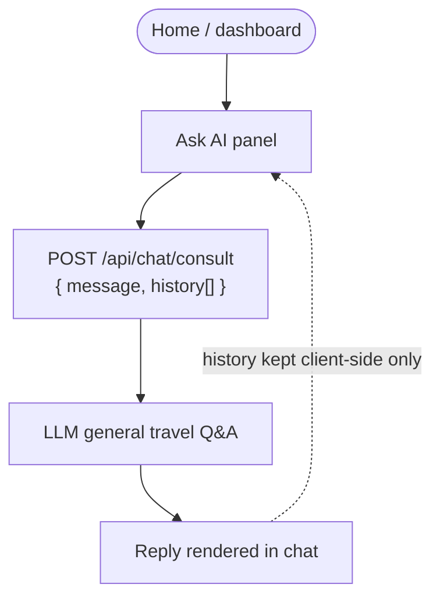
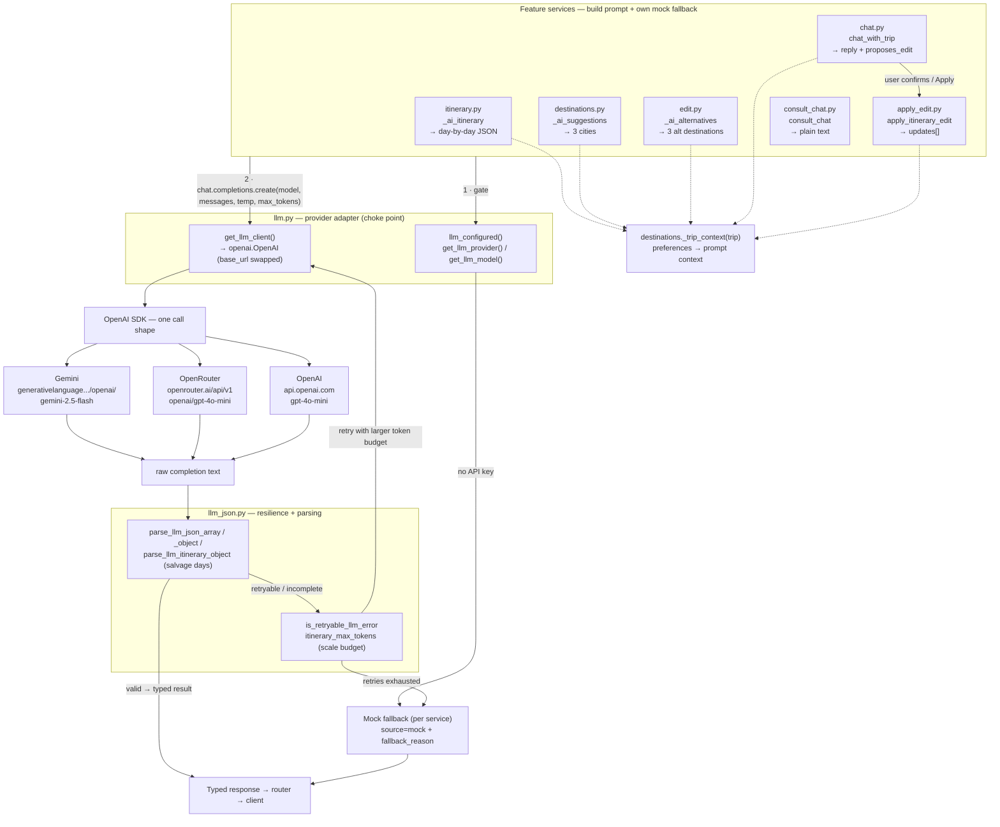
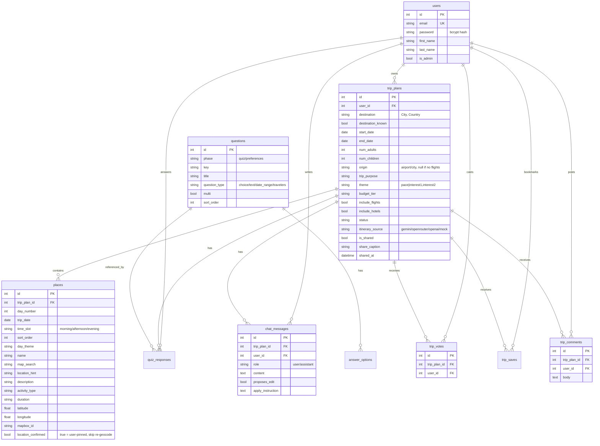

# RihlaTech — Technical Summary

> Personal reference doc. Written for future-me returning after a break.
> Source of truth is still `plan.md`; this is the "how it actually fits together" map.
> Last synced with the codebase: reflects `dev` branch (long-trip fix, per-card
> flight/hotel links, Mapbox lodging hotels).

---

## 1. Project Overview

RihlaTech is an AI travel-planning web app built for the KSU IS498 capstone. A user
registers, answers a short logistics quiz plus a personalization step, and gets a
day-by-day itinerary generated by an LLM, with real venue names, map deep-links, and
optional flight/hotel suggestions. On top of the core planner it has a trip-tied
chatbot (propose/apply itinerary edits), a general "Ask AI" consult chat, and a
community layer for sharing, voting, saving, and commenting on itineraries.

**Problem it solves:** planning a trip normally means juggling dates, budgets,
destinations, and a dozen browser tabs. Generic tools either give you nothing
personalized or leave all the assembly work to you. RihlaTech collapses that into
"answer a few questions → get a personalized plan → refine it by chatting."

**Current state:**
- **Live (prod, `main`):** auth, quiz + preferences, AI itinerary generation, Mapbox
  geocoding + Google Maps deep-links, trip chatbot + apply-edit, My Trips history,
  consult chat, flights/hotels (Duffel sandbox + mock), community, admin dashboard,
  PWA. Deployed on Vercel (frontend) + Render (API) + Neon (Postgres 16).
- **On `dev`, not yet merged:** long-trip (≥6 nights) itinerary fix via scaled token
  budget + JSON salvage, per-offer Google Flights deep-links, Mapbox lodging hotel
  names with mock fallback.
- **Deferred:** multi-city trips, transport modes, quiz-flow redesign polish (mostly
  done), Images API (Pexels), nationality/passport question, native/Capacitor mobile
  app. See §9.

---

## 2. Architecture

The frontend is a **single-page React app** with no router library — "pages" are
switched via React state inside `HomePage.tsx` (`TripPlanner`), and `App.tsx` only
gates authenticated vs. login/register. The frontend talks to the FastAPI backend
over a REST API prefixed with `/api`, sending a JWT bearer token. The backend owns
all business logic and is the **only** thing that talks to Postgres and to the LLM.
External booking/navigation services (Google Maps, Google Flights, Booking.com) are
reached via **deep-links built client-side** — no SDK, no API key, no server round-trip.
Mapbox and Duffel are called from the backend; Mapbox Directions (walking polyline)
is the one external API the frontend calls directly (optional, `VITE_MAPBOX_ACCESS_TOKEN`).



**Request lifecycle (typical):** React `lib/*` helper → `apiFetch` attaches JWT →
FastAPI router (`get_current_user` dependency validates token) → service function →
SQLAlchemy session / external API → Pydantic response schema → JSON back to client.

**Schema management:** there are no Alembic migrations. On startup `main.py:lifespan`
runs `Base.metadata.create_all` and then `_ensure_schema_patches()` — a set of
idempotent `ALTER TABLE ... ADD COLUMN IF NOT EXISTS` statements for columns added
after the initial tables (e.g. `itinerary_source`, `map_search`, `location_confirmed`,
`is_shared`). Quiz questions are re-seeded on every boot via `seed_questions()`.

---

## 3. Tech Stack

| Layer | Choice | Version / detail | Why |
|---|---|---|---|
| Frontend framework | React | 18 | Team familiarity; component model fits the wizard-style flow |
| Build tool | Vite | — | Fast dev server + `VITE_*` env injection; simple SPA build for Vercel |
| Styling | Tailwind CSS | — | Utility-first, fast iteration; consistent with shadcn/ui |
| UI components | shadcn/ui (Radix under the hood) | `src/components/ui/*` | Accessible primitives, copy-in components (no runtime dep lock-in) |
| Animation | Framer Motion | — | Loader animations, quiz transitions |
| Routing | **None (state machine in `HomePage.tsx`)** | — | App is small; a full router was unnecessary. `App.tsx` only splits auth vs. app |
| Backend framework | FastAPI | — | Async-capable, Pydantic validation, auto `/docs`, minimal boilerplate |
| ORM | SQLAlchemy 2.x (typed `Mapped[...]`) | — | Mature; typed models; `Session`-based |
| Validation/schemas | Pydantic + pydantic-settings | v2 | Request/response schemas in `app/schemas/`; settings in `config.py` |
| Database | PostgreSQL | 16 | Docker locally on host port **5433** (5432 clashes with local Windows PG); Neon in prod |
| Auth | JWT (`python-jose`) + `bcrypt` | 7-day expiry (`jwt_expire_minutes`) | Stateless tokens; no session store needed |
| LLM SDK | `openai` Python SDK | — | One SDK, three providers via `base_url` swap (see §5) |
| LLM (default dev) | Gemini `gemini-2.5-flash` | via OpenAI-compat endpoint | Reliable JSON output; free tier; plan.md notes "prefer Gemini for reliability" |
| LLM (alternates) | OpenRouter `openai/gpt-4o-mini`, or direct OpenAI `gpt-4o-mini` | — | Flexibility / fallback |
| Geocoding + POI | Mapbox Geocoding v5 + Search Box v1 | backend only | City autocomplete, activity POI resolution, hotel/airport POIs. No Google Places (billing/setup pain) |
| Flights | Duffel sandbox (`api.duffel.com`, `Duffel-Version: v2`) | test token | Real-ish offer data in a sandbox; airport autocomplete via `/places/suggestions` |
| Hotels | Mapbox lodging POI + mock cards | — | Real hotel names when ≥3 POIs; no RapidAPI scrapers, no Booking API |
| Booking/nav links | Google Maps, Google Flights, Booking.com **deep-links** | no key | Deliberate: opens external app, zero API cost/setup (see §8) |
| Deploy | Vercel (frontend) + Render (API, `render.yaml`) + Neon (DB) | — | Auto-deploy from `main` |
| PWA | `public/manifest.json` + `public/sw.js` | — | Installable, mobile-friendly; native app deferred |

---

## 4. User Flows

The app always lands on **Home** after login (never the last trip page). `localStorage`
keeps the last `tripPlanId` only as an internal resume hint.

### 4a. New trip (quiz → preferences → generation → result)

Quiz questions are seeded in `quiz_seed.py`. The origin question is **conditional** —
only asked if the user opts into flight suggestions. The destination question is
skipped for the "not sure" path (AI picks candidates later).



Key detail: `POST /trips/generate` is LLM-bound and blocks the loader; Mapbox
geocoding of activity pins is **deferred** to a background `enrich-places` call on the
result page so it doesn't slow the perceived generate time. `TripResult` distinguishes
loading copy: "Loading your trip…" on the `GET` path vs. generation copy on the `POST
/generate` path, and auto-retries generate once if days come back empty
(`tripHasItineraryActivities`).

### 4b. Returning user (My Trips → reopen)



### 4c. Community (share → discover → comment)



Shared itineraries are **read-only** for viewers (rendered via the same
`_build_response` used for the owner's trip). Votes and saves are unique per
(trip, user) — the endpoints toggle a row in `trip_votes` / `trip_saves`.

### 4d. Ask AI (consult chat, no trip)



Consult chat is **stateless server-side**: the client sends the last ~10 messages in
`history` on each request; nothing is persisted to the DB (contrast with trip chat in
§5, which is stored in `chat_messages`).

---

## 5. LLM Layer

### Architecture at a glance

The LLM layer is a **layered provider-adapter architecture**, not a single client call
sprinkled around the codebase. There are three tiers:

1. **Feature services** (`itinerary`, `destinations`, `edit`, `chat`, `apply_edit`,
   `consult_chat`) — each builds its own task-specific prompt, owns a deterministic
   **mock fallback**, and expects a specific output shape. They all share prompt
   context from `destinations._trip_context(trip)` (preferences → text block).
2. **Provider adapter** (`llm.py`) — the single choke point. It hides Gemini /
   OpenRouter / OpenAI behind one `openai.OpenAI` client by swapping `base_url` (+
   headers), so every consumer calls the identical `client.chat.completions.create(...)`
   regardless of provider. Consumers first gate on `llm_configured()`.
3. **Resilience + parsing** (`llm_json.py`) — shared error classification
   (`is_retryable_llm_error`), token-budget scaling (`itinerary_max_tokens`), and JSON
   extraction/salvage (`parse_llm_json_array`, `parse_llm_json_object`,
   `parse_llm_itinerary_object`). This is what makes free/truncating models usable.

The recurring per-call pattern is: **gate → build prompt → call adapter → parse →
retry on retryable error (bigger token budget) → fall back to mock when the key is
missing or retries are exhausted.**



**How to read it:** solid arrows are the call/data path; dotted arrows show shared
prompt context. The `chat → apply_edit` edge is the propose/apply handoff (see below).
Note `consult_chat` returns plain text (no JSON parsing), while the other five expect
structured JSON and therefore route through `llm_json.py`.

### How the LLM is called (`services/llm.py`)

One module, one SDK (`openai.OpenAI`), three providers. Selection order:

1. `LLM_PROVIDER` env var if it's explicitly `openrouter` / `gemini` / `openai`.
2. Otherwise auto-detect by which key is present, in order: **Gemini → OpenRouter → OpenAI**.

Provider differences are just base URL + model + headers:
- **Gemini:** `base_url = https://generativelanguage.googleapis.com/v1beta/openai/`, model `gemini-2.5-flash` (OpenAI-compatible endpoint, so the same `client.chat.completions.create` call works).
- **OpenRouter:** `base_url = https://openrouter.ai/api/v1`, model `openai/gpt-4o-mini`, plus `HTTP-Referer` / `X-Title` headers.
- **OpenAI:** default base URL, model hard-coded to `gpt-4o-mini`.

Helpers: `llm_configured()`, `get_llm_provider()`, `get_llm_model()`, `get_llm_client()`
(returns `None` if no key → callers fall back to mock content). Provider/model are
surfaced at `GET /api/health/llm`.

### `services/itinerary.py` — step by step

`generate_itinerary(db, user, trip_plan_id)` is the entry point behind
`POST /trips/generate`:

1. Load the trip for the user (`_get_trip_for_user`); 400 if no destination.
2. If `llm_configured()`, call `_ai_itinerary(trip)`; on any exception, log and fall
   back to `_mock_itinerary(trip)` (source becomes `"mock"`, `fallback_reason` set).
3. `_ai_itinerary`:
   - Compute `num_days` via `_trip_day_count` (clamped 1–14; defaults to 3 if dates missing).
   - Build a strict JSON prompt demanding **real venue names** (no "walking tour",
     "sunset viewpoint"), exactly `num_days` days × 3 activities (morning/afternoon/evening),
     and lat/lng per activity. Preferences injected via `_trip_context` (from `destinations.py`).
   - Retry loop (up to 3): call the model with a scaled `max_tokens` (see below),
     then `parse_llm_itinerary_object(content, expected_days=num_days)`. Retries only
     on retryable errors (`is_retryable_llm_error`: 429/503/rate/quota/JSON/truncation).
4. `_persist_itinerary(db, trip, payload)`:
   - Delete existing `places` for the trip.
   - Resolve the destination center once via Mapbox (`_resolve_destination_center`).
   - For each activity: normalize the time slot, prefer `map_search` as the canonical
     venue name, and resolve coordinates through `resolve_place_coordinates` (Search
     Box POI → legacy geocoding → validated LLM-provided coords as last resort).
   - Insert `Place` rows.
5. Set `trip.status = "itinerary_generated"`, `trip.itinerary_source = provider`, commit.
6. `_build_response` groups places by day into `DayItineraryPublic`, builds `map_pins`
   (only places with coords), and returns `GenerateTripResponse`.

`GET /trips/{id}` (`get_trip_detail`) reuses `_build_response`, and if Mapbox is
configured and pins are missing/out-of-range it runs `enrich_trip_places` inline.

### `max_tokens` scaling for long trips (`services/llm_json.py`)

This was the fix for "itinerary fails for ≥6 nights" (LLM truncating output).

```python
ITINERARY_BASE_TOKENS = 800
ITINERARY_TOKENS_PER_DAY = 380
ITINERARY_MAX_TOKENS = 8192

def itinerary_max_tokens(num_days: int) -> int:
    budget = ITINERARY_BASE_TOKENS + max(1, num_days) * ITINERARY_TOKENS_PER_DAY
    return min(ITINERARY_MAX_TOKENS, max(LLM_MAX_TOKENS, budget))
```

So a 3-day trip ≈ 1,940 tokens, a 14-day trip caps at 8,192. On retry the budget is
bumped further (`token_budget + 2048 * attempt`, capped at the max). If the response is
still truncated, `parse_llm_itinerary_object` **salvages** whatever complete day
objects it can from the `"days": [...]` array (`_salvage_days_from_itinerary_text` +
`_salvage_objects_from_array_slice`) and only raises if fewer than `expected_days`
survive — which then triggers a retry with more tokens.

### Chatbot edit flow (propose → apply)

Two services and two endpoints:

- **`services/chat.py`** (`POST /chat/message`): trip-tied, persisted to `chat_messages`.
  The LLM is instructed to reply as JSON `{ reply, proposes_edit, apply_instruction }`.
  When it proposes a change it sets `proposes_edit=true` and a self-contained
  `apply_instruction` (must name day + current activity + replacement). That assistant
  message is saved with `proposes_edit=true` so the UI can show an **Apply** button.
- **Confirmation shortcut:** if the user's next message matches `CONFIRM_RE`
  ("yes", "do it", "apply", "sounds good", …), `chat_with_trip` finds the last pending
  edit (`_last_pending_edit`) and calls `apply_itinerary_edit` directly — no button tap
  needed. Continuing the conversation without confirming clears stale Apply buttons
  (`_supersede_pending_edits`), and a pending edit is fed back into the system prompt so
  refinements target the **same** activity.
- **`services/apply_edit.py`** (`POST /trips/{id}/apply-edit`, also called internally):
  sends the itinerary with `place_id`s and the instruction, asks the LLM for an
  `updates: [{ place_id, name, map_search, lat, lng, ... }]` payload, mutates matching
  `Place` rows, re-geocodes changed places, and returns the refreshed `TripDetail`.
  The optional `chat_message_id` marks that chat message as applied (`mark_chat_edit_applied`).

There's also `services/edit.py` (`POST /trips/{id}/edit`) — a **different** feature that
returns 3 alternative *destinations* (not itinerary edits), used by the "explore
alternatives" UI.

### Consult chat vs. trip chat

| | Trip chat (`chat.py`) | Consult chat (`consult_chat.py`) |
|---|---|---|
| Endpoint | `POST /chat/message`, `GET /chat/{id}/messages` | `POST /chat/consult` |
| Requires a trip | Yes (must have generated places) | No |
| History | Persisted in `chat_messages` (loaded from DB, last 12 to LLM) | Client-side only, sent in request body (last 10) |
| Can edit itinerary | Yes (propose/apply) | No — general advice only, nudges user to "Plan a new trip" |
| System prompt | Trip-aware: injects preferences + full itinerary summary | Generic travel assistant, greets by first name |
| Fallback when no LLM | Canned `MOCK_REPLY` | Canned `MOCK_REPLY` |

---

## 6. Data Model

Models live in `app/models/`. All tables are created via `Base.metadata.create_all`
plus the `_ensure_schema_patches()` `ADD COLUMN IF NOT EXISTS` calls.



**Notable encodings / conventions:**
- `trip_plans.theme` packs two preferences into one string: `"{pace}|{interest1,interest2}"`
  (see `theme_preferences.py`, `encode/decode_theme_preferences`). This avoids adding
  columns for the preferences redesign.
- `origin` is nulled server-side when `include_flights` is not "yes" (in `quiz.py`).
- `places.location_confirmed = true` means the user manually pinned the location on the
  map; geocoding then **skips** it (`place_needs_geocode` / `enrich_trip_places`).
- `trip_votes` and `trip_saves` have a `UniqueConstraint(trip_plan_id, user_id)` — the
  endpoints toggle (insert/delete) rather than increment.
- Everything cascades on user/trip delete (`ondelete="CASCADE"` + relationship cascades).

**What gets created at each step of the flow:**
| Step | DB writes |
|---|---|
| Register | `users` row (bcrypt password) |
| Quiz submit (`phase=quiz`) | `trip_plans` row created (or updated) + `quiz_responses` rows; fields mapped in `_apply_answer_to_trip`; `status="quiz_complete"` |
| Preferences submit | more `quiz_responses`; `theme` encoded; `status="preferences_complete"` |
| Destination suggest/select | `trip_plans.destination` set, `status` progresses |
| Generate | old `places` deleted, new `places` inserted; `status="itinerary_generated"`, `itinerary_source` set |
| Background enrich | `places.latitude/longitude` updated |
| Trip chat | `chat_messages` rows (user + assistant) |
| Apply edit | `places` rows mutated |
| Share | `trip_plans.is_shared/share_caption/shared_at` set |
| Vote/save/comment | `trip_votes` / `trip_saves` / `trip_comments` rows |

---

## 7. External Services

### Mapbox (`services/geocoding.py`)
Backend-only, one public `pk.…` token (`MAPBOX_ACCESS_TOKEN`). Two APIs:
- **Geocoding v5** (`.../geocoding/v5/mapbox.places`): city autocomplete for the
  destination step (`search_places`, `types=place,locality,region`), destination
  centering (`geocode_destination`), and reverse country lookup. City labels are
  normalized to `"City, Country"` and de-`Al-`'d (`_normalize_city_label`).
- **Search Box v1** (`.../search/searchbox/v1/forward`): POI resolution for activities
  (`search_activity_places`), lodging POIs for hotels (`_searchbox_lodging_results`,
  `poi_category=hotel`), and airport POIs (`_searchbox_airport_results`,
  `poi_category=airport`, used only as a fallback to Duffel).

Activity geocoding is a **scored match** (`_score_feature` / `_score_searchbox_result`):
token overlap with the venue name, distance from destination center (≤40 km),
country match, POI bonus, minimum score `0.38`, and rejection of pins too close to the
city center (bad matches). Resolution order in `resolve_place_coordinates`:
Search Box POI → legacy geocoding → validated LLM-provided coords.
Gotcha (documented in code): Geocoding v5 `types=poi` does **not** return airports, so
airport search must not use it. Status: `GET /api/health/mapbox`.

### Duffel (`services/flights.py`)
Sandbox flight search. `DUFFEL_ACCESS_TOKEN` (test token starts `duffel_test_`),
`Duffel-Version: v2`, called with `urllib` (no SDK).
- **Airport autocomplete:** `GET /places/suggestions` (`search_airport_suggestions`),
  primary source for the origin step; resolves free text / IATA / city to airport codes
  (`_resolve_place_code`).
- **Offer search:** `POST /air/offer_requests?return_offers=true` with slices
  (one-way or round-trip based on trip dates) and passengers derived from
  `num_adults`/`num_children` (`_search_duffel`).
- **Fallback chain** (`search_flights`): if origin/destination codes can't be resolved,
  or Duffel isn't configured, or it returns no offers/errors → `_mock_offers` (tiered
  by budget) with `source="mock"` and a `fallback_reason`.
- **Deep-links:** every offer (real or mock) gets its own Google Flights URL via
  `_google_flights_url` (IATA codes + `through {return_date}` + airline name so cards
  differ). Prices carry a `price_note`: Duffel = "Total for N travelers", mock = "Est.
  per person". Status: `GET /api/health/duffel`.

### Hotels (`services/hotels.py`)
No hotel API. Two sources:
- **Mapbox lodging POIs** (`search_lodging_hotels`) for real hotel names near the
  destination center. Used only when it returns **≥3** results (`MIN_MAPBOX_HOTELS`);
  star ratings / amenities / nightly prices are tier-based estimates layered on top.
- **Mock cards** (`_mock_hotels`, `HOTEL_BLUEPRINTS` by budget tier) otherwise (e.g.
  sparse-POI cities like Tokyo).
- **Booking.com deep-links** per card (`_hotel_booking_url`): `ss="{name}, {city}"` +
  trip check-in/out + guest count, so each card links to a distinct search rather than
  a generic one. Price note: "Per room per night · N guests".
- **Mapbox POI plan:** the intent is that Mapbox lodging POIs give real, mappable hotel
  names; the mock tier fills gaps and provides consistent price/amenity framing.

### Google Maps (frontend `lib/mapDirections.ts`)
**Deep-links only, no SDK, no key.** Per-activity search
(`googleMapsSearchUrl` → `.../maps/search/?api=1&query=`), per-leg directions
(`googleMapsLegUrl`), and a per-day multi-stop route (`googleMapsDayRouteUrl`, capped at
Google's ~9 waypoints / 11 stops, with `dayRouteExceedsWaypointLimit` guarding the UI).
Separately, `fetchWalkingRoute` calls the Mapbox Directions API directly from the
browser (needs `VITE_MAPBOX_ACCESS_TOKEN`) just to draw a walking polyline — optional
and degrades to `null`.

### OpenRouter / LLM provider switching
Covered in §5. Summary: `LLM_PROVIDER` in `.env` (`auto`/`gemini`/`openrouter`/`openai`)
picks the provider; `auto` falls through Gemini → OpenRouter → OpenAI based on which key
exists. Because all three are called through the OpenAI SDK with a swapped `base_url`,
the rest of the code (`itinerary`, `chat`, `edit`, `destinations`) is provider-agnostic.

---

## 8. Key Design Decisions

- **Deep-links over SDKs (Google Maps / Flights, Booking.com).** No API keys, no
  billing, no OAuth, no map-render licensing. Trade-off: no in-app booking or embedded
  live maps, but for an FYP the setup/cost savings win and the UX (open in the user's
  own Maps/Booking app) is acceptable. Explicitly listed in `plan.md` under "Avoid for FYP".
- **Per-day token scaling + JSON salvage** instead of a fixed `max_tokens`. Long trips
  were silently truncating LLM JSON; scaling the budget with day count and salvaging
  partial `days` arrays fixed generation for 6–14 night trips without over-paying tokens
  on short trips.
- **Conditional origin question.** Origin/airport is only asked when the user wants
  flight suggestions; otherwise it's skipped and nulled server-side. Keeps the quiz
  short and supports "local / no-flight" trips naturally.
- **PWA over native app.** `manifest.json` + service worker make it installable and
  mobile-friendly without maintaining a native codebase. Capacitor is deferred (§9).
- **One LLM module, three providers via OpenAI SDK.** Swapping `base_url` means only
  `llm.py` knows about providers; switching is an env var, and every consuming service
  stays identical.
- **State-machine "routing" in `HomePage.tsx`** instead of a router library. The app is
  a small, mostly linear wizard; a router added complexity without benefit. `App.tsx`
  handles only the auth boundary.
- **Mock fallbacks everywhere** (itinerary, destinations, flights, hotels, chat). Every
  external/LLM call degrades to deterministic mock content with a `source`/`fallback_reason`
  rather than erroring, so the app is always demoable even without keys.
- **Geocoding deferred to background** on the result page so the generate spinner is
  gated only on the LLM, not on Mapbox round-trips.
- **`theme` field encodes pace + interests** as a single string to avoid schema churn
  during the preferences redesign.
- **No Alembic; idempotent `ALTER TABLE IF NOT EXISTS`** patches on startup. Lightweight
  for a solo/FYP project; every added column is backfilled safely on boot.
- **Trip chat persisted, consult chat not.** Trip edits need durable state (Apply
  buttons, refinement context); consult is throwaway advice, so keeping it client-side
  avoids DB writes for anonymous-ish Q&A. (Persisting consult chat is a deferred item.)

---

## 9. Known Limitations & Deferred

**Intentionally not built yet:**
- **Multi-city / multi-country trips.** Single `destination` per trip; itinerary,
  flights, and hotels all assume one city. Product decision still open (one trip vs.
  linked sub-trips). This is the biggest structural limitation.
- **Transport modes.** No modeling of how the traveler moves between cities/activities
  beyond Google Maps driving/walking deep-links; no inter-city transport suggestions.
- **Local trips (origin = destination).** Superseded by the conditional-origin redesign
  (origin is simply skipped when flights aren't included) rather than a dedicated flow.
- **Capacitor / native mobile app.** Currently a PWA only. Native packaging is deferred.

**Quiz flow redesign (mostly done, residual polish):**
- Conditional origin question and Mapbox city normalization (`"City, Country"`,
  `Al-Riyadh → Riyadh`) are **done**.
- Residual: destination-picker "TBD" edge case (if a destination gets set to TBD during
  AI suggestion, "try again" can confusingly ask to add a destination). Combining the
  flights (quiz) + hotels (preferences) questions into one optional "booking links" step
  is still undecided/low priority.

**Deferred features / polish (from `plan.md`):**
- Images API (Pexels) for destination/trip visuals (needs `PEXELS_API_KEY`).
- Nationality/passport question for visa awareness.
- Stricter email TLD validation (e.g. `email@gmail.cos` still passes).
- Desktop home/dashboard wide-screen layout.
- Persist consult chat server-side.
- `/welcome` marketing route.

**Operational gotchas to remember:**
- Postgres runs on host port **5433** locally (Docker maps `5433:5432`).
- Restart the backend after any `.env` change; restart `npm run dev` after `VITE_*` changes.
- Restart the backend after pulling so `seed_questions()` re-seeds updated quiz copy.
- Prefer Gemini for JSON reliability; Duffel test token must start `duffel_test_`.
- All active work is on the `dev` branch; `main` auto-deploys to Vercel/Render.
